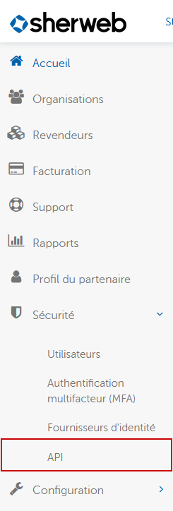
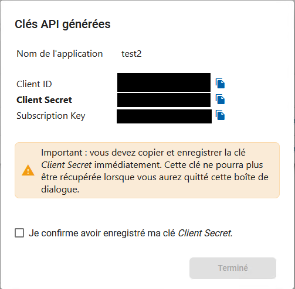

# APIs publiques Sherweb

[Version anglaise](README.md)

## Prérequis pour utiliser les APIs

Vous devez avoir ajouté une application avec des clés d'API dans Sherweb Cumulus: https://cumulus.sherweb.com. Dans le menu de gauche, en dessous de sécurité, cliquez sur le menu APIs:

Ajouter une nouvelle application. Faites attention d'avoir copier le clientId, client secret et la subscription key puisqu'ils sont requis pour utiliser les APIs:

## Code source des nugets

Nous avons une organisation chez nuget.org: (https://www.nuget.org/profiles/Sherweb). Tous les nugets publiques sont là. Ce repertoire présente tout le code source de ces nugets si vous voulez les générer vous mêmes au lieu d'utiliser les nugets. Chaque dossier est un API et il existe un LisezMoi pour chacune. Pour générer le code, you devez ouvrir le fichier .slm dans Visual Studio.

## Exemple de code

Dans le dossier Sherweb.SampleCode, vous trouverez tous les exemples démontrant comment utiliser les nugets. Tous les exemples sont en c#. C'est à ce moment là que vous aurez besoin du clientId, client secret et de la subscription key. N'hésitez pas à soumettre des améliorations de code.

## Documentation

Pour toutes la documentation en rapport avec ces APIs, vous pouvez les trouver ici: https://apim-prod-sherweb.developer.azure-api.net/.

## Contribution

[Vous pouvez soumettre des bugs ou des requêtes de fonctionnalité](https://github.com/sherweb/Public-Apis/issues), et nous aider à les vérifier au fur et à mesure qu'ils sont enregistrés.

## Licence

Copyright (c) Sherweb Inc. Tous droits réservés.
Sous la licence [MIT](LICENSE.txt).
