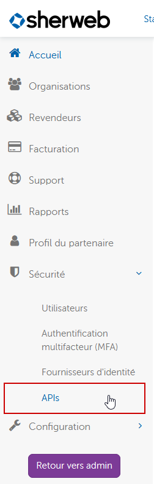

# API publiques de Sherweb

[English version](README.md)

## Préalable pour utiliser les API

Vous devez avoir ajouté une application avec des clés API dans le portail des partenaires de Sherweb (https://cumulus.sherweb.com). Dans le menu de gauche, sous « Sécurité », cliquez sur le menu des API :

Ajoutez une nouvelle application. Assurez-vous de copier l'identifiant client, le secret client et la clé d'abonnement, qui sont requis afin d'utiliser les API :

## Code source des nugets

Nous avons une organisation chez NuGet (https://www.nuget.org/profiles/Sherweb). Tous les paquets NuGet publics s'y trouvent. Ce dépôt présente tous les codes sources des paquets, si vous voulez les générer vous-même au lieu d'utiliser les paquets NuGet. Chaque dossier est un API et comprend un fichier Lisez-moi. Pour générer un code, vous devez ouvrir le fichier .sln dans Visual Studio.

## Exemple de code

Dans le dossier « SampleCode », vous pouvez trouver tous les exemples démontrant comment utiliser les paquets NuGet. Tous les exemples sont en langage C#. C'est là que vous aurez besoin de l'identifiant client, du secret client et de la clé d'abonnement. N'hésitez pas à nous soumettre des améliorations de code.

## Documentation

Vous pouvez trouver toute la documentation relative à ces API ici : https://developers.sherweb.com/.

## Demande de soutien

Vous pouvez envoyer des demandes de soutien à partir du [portail des partenaires de Sherweb](https://cumulus.sherweb.com/nexus/redirect/support?ticket=new).

## Contribution

[Vous pouvez soumettre des bogues reliés au code ou des demandes de fonctionnalité](https://github.com/sherweb/Public-Apis/issues), et nous aider à les vérifier au fur et à mesure qu'ils sont enregistrés.

## Licence

Copyright (c) Sherweb Inc. Tous droits réservés.
Sous la licence [MIT](LICENSE.txt).
