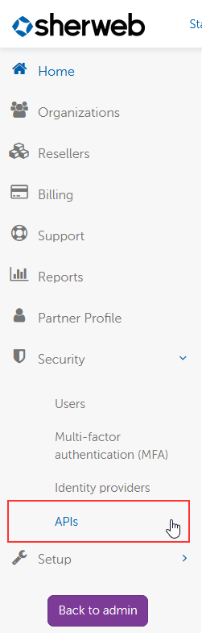
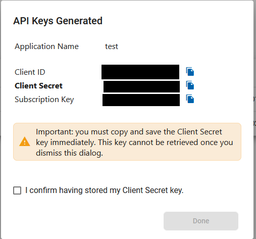

# Sherweb public APIs

[French version](LISEZMOI.md)

## Prerequisite for using the APIs

You need to have add an application with API keys in Sherweb Cumulus: https://cumulus.sherweb.com. In the left menu, under Security, click on Apis menu: 

Add a new application. Make sure to copy the clientId, client secret and subscription key since they are required in order to use the APIs:

## Nugets source code

We have an organization on nuget.org: (https://www.nuget.org/profiles/Sherweb). All public nugets are there. This repository provides all the source code of these nugets if you want to build it on your own instead of using the nuget. Each folder is an API and there is a readme for each API to help you using it. To build the code, you gonna need to open the .sln file in Visual Studio.

## Sample code

In the folder Sherweb.SampleCode, you can find all examples on how to use the nugets. All examples are made in c#. This is where the clientId, client secret and subscription key are gonna be use. Feel free to submit us any code enhancement.

## Documentation

For all documentation related to these APIs, you can find it here: https://developers.sherweb.com/. 

## Contributing

[You can submit bugs and feature requests](https://github.com/sherweb/Public-Apis/issues), and help us verify as they are checked in.

## Support

If you need support, you can send a ticket [here](https://support.sherweb.com/SupportRequest).

## License

Copyright (c) Sherweb Inc. All rights reserved.
Licensed under the [MIT](LICENSE.txt) license.
